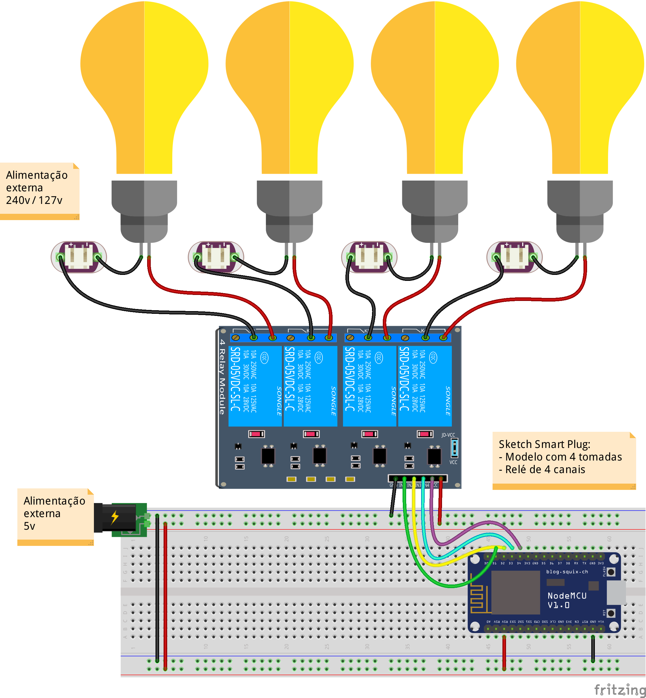
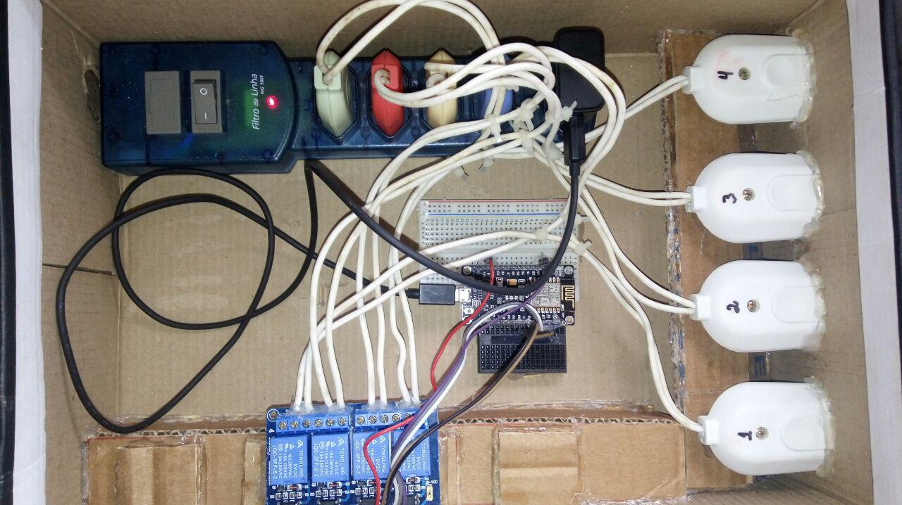

# Smart Plug v1.2
Repositório do Projeto de Sistema Web para Controle de Arduino via Interface de Rede Local. O projeto pode ser adaptado para conexões externas via internet.

## Desenvolvedores
- André Henrique
- Bhrandon Borges
- Lucas Toloto

## Diretórios
- smartplug_webserver (código fonte do projeto em arduino e sketch no fritzing)
- projeto_web (código fonte da aplicação web, criada em Laravel v5.5)
- img_exp (imagens do protótipo construido)

## Configurações do projeto atual para fins de testes
- ESSID: UniaoGeek
- Chave Wifi: geek@uniao
- Channel: 1
- IP Gateway: 192.168.0.1
- IP Arduino/NodeMCU: 192.168.0.100

## Configurações do Banco de Dados
- Como o DB pode ser relativo à cada computador, verifique as tabelas nas migrates do laravel e configure seu DB.
- Caso tenha problemas, é só entrar em contato.

## Hardware e Software
- Protótipo com NodeMCU v1.0
- Alimentação do NodeMCU com Fonte Externa de 5v
- Módulo Rele de 4 canais
- 4 plugs de tomadas (macho/fêmea) + 1 filtro de linha ligado em 127v
- Aplicação Web desenvolvido em linguagem PHP utilizando Framework Laravel v5.5

## Sketch do Projeto em Protoboard

  

  

  

